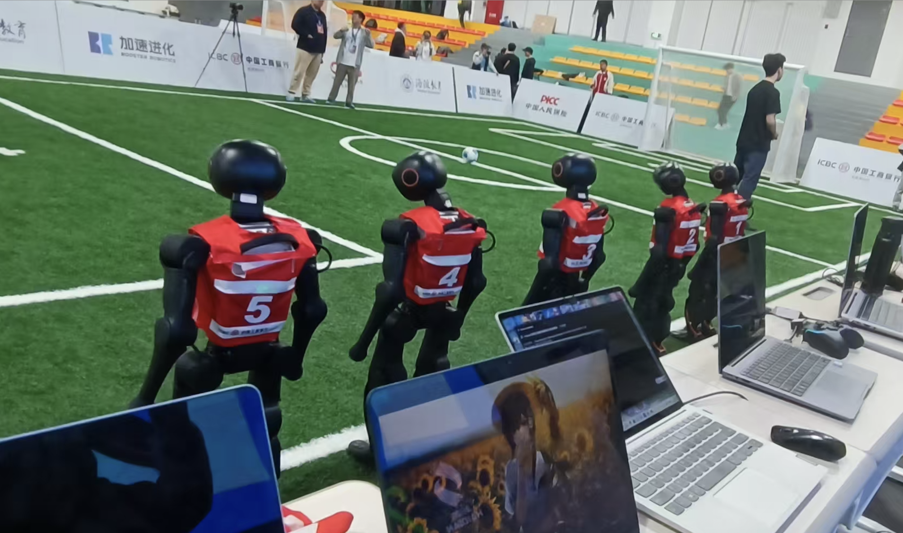
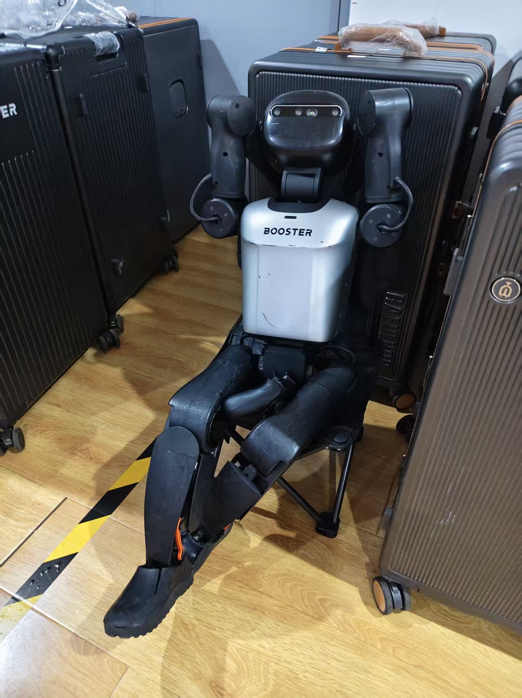

# 足球机器人比赛程序 Booster-K1-5v5 



## 项目简介
本项目是为 **海淀区中学生人形机器人足球联赛**（5v5）开发的机器人代码程序。该比赛中，机器人自主决策和行动，不通过人工远程操控，需要设计完善的策略和算法。

该项目由 ***八一学校*** 参赛队员，在官方 demo 的基础上，进行了一些细节修改与功能补充，优化了机器人的踢球、团队协作、守门员等许多方面。我们希望通过开源代码，与大家共同探讨机器人策略以及实现方法，互相交流学习。

## 硬件与固件支持
- **适用机器人平台**：Booster K1
- **兼容固件版本**：**v1.5** 版本（注：本项目对 1.5 版本固件中的新型视觉踢球等机制进行了适配，与老版本 1.4 固件存在部分不兼容情况）
- **支持相机硬件**：realsense 相机。 （其他相机未进行测试）

## 分支说明
- `main`：主分支，包含最稳定、经过比赛验证的完整代码
- `BotExp`：实验性分支，用于测试一些激进的 AI 行为和寻球辅助逻辑，包含部分未合入主线的特性
- `gk-damp` / `gk-damp-new`：守门员专项测试分支，专门用于优化守门员的扑救（Damping Save）逻辑等实验性改动

## 核心策略优化

结合比赛规则与实战需求，我们在程序上进行了如下主要修改：

### 1. 强化学习视觉踢球 (RL Vision Kick)
- 实现了全新的 `RLVisionKick` 行为树节点，替代了传统的固定动作踢球
- **防空踢**：调整踢球力度（`power_shoot`）至 10，这能略微缓解踢不准的问题

### 2. 守门员策略升级
- 启用了视觉踢球（Vision Kick）用于守门员主动出击和解围
- test：根据识别到的球速（`ballVelX`, `ballVelY`）预测球的未来落点，提前移动到最佳防守位置。有待改进
- test: 对阻尼模式扑救进行了测试。有待改进

### 3. 角色动态切换与协作
- **动态角色分配**：优化了 `RoleSwitch` 逻辑，确保场上任何时候都至少有 1 个守门员。如果原守门员决定出击，离球门最近的前锋/后卫会自动补位成为临时守门员
- **Cost 评估体系优化**：基于距离、偏航角、场地位置等维度计算团队代价排名（`tmMyCostRank`），优化了任意球（FreeKick）、入场定位及接应（Assist）时的站位分配；增加了持球队员 cost 特殊处理，使其不易被打断。

### 4. 寻球与防卡死逻辑
- **寻球辅助**：当自身丢失球的视野时，会通过团队通信读取队友分享的高置信度球位置（`tm_ball_pos`），快速转向寻球
- **Adjust 超时机制**：防止机器人在微调位置时死锁，增加了 `adjust_timeout_secs` 参数，超过限定时间自动恢复 Chase（追球）状态
- test: 根据队友的信息以及自己的信息 (FieldDimension & ballPos) ，来核验自己的定位信息是否正确。 未测试

### 5. 添加一键配置的脚本 set_up.sh
- 自动解决所有可执行文件权限问题
- 自动生成用于一键启动相机与系统节点的快捷启动脚本 `1.sh`
- 提供交互式命令行，支持快速设置 `team_id`、`player_id`、`player_role` 以及裁判机IP，并自动同步更新至 `config.yaml` 和 GameController 的白名单中
- **比赛安全防护**：通过配置 iptables 防火墙规则，限制仅允许特定网段（`192.168.10.0/24`）进行 SSH 连接，从而防止其他未授权设备的恶意访问和干扰

### 6. 修复bug
 - 由于二级比赛状态的使用与定义不符，导致的逻辑问题
 - 角色切换逻辑
 - 踢球连续性问题

## 核心目录结构
```text
Booster-K1-5v5/
├── docs/                 # 官方文档、比赛规则说明、API手册与策略修改建议
├── scripts/              # 部署与启动脚本 (build.sh, start.sh, after.sh等)
├── src/
│   ├── brain/            # 大脑与行为树节点代码 (C++)
│   │   ├── behavior_trees/ # XML格式的行为树配置文件 (game.xml, subtree_*.xml)
│   │   ├── config/       # 策略核心配置文件 (config.yaml，会从脚本生成)
│   │   ├── include/      # 头文件定义
│   │   └── src/          # 核心行为逻辑实现 (brain.cpp, brain_tree.cpp等)
│   └── vision/           # 视觉感知与图像处理节点
│       ├── model/        # 深度学习检测与分割模型
│       └── src/          # 视觉推理节点逻辑 (vision_node.cpp等)
└── set_up.py             # 环境配置与一键安装初始化脚本
```

## 构建与部署指南

1. **环境准备**
   确保是 Booster 机器人，且系统已正常运行 ROS2 环境，并运行官方提供的 v1.5 版本固件。具体可见 [Booster 官网](https://www.booster.tech)

2. **初始化配置**
   运行项目根目录下的设置脚本，一键配置文件权限，生成 `src/brain/config/config.yaml`，并配置安全网络规则：
   ```bash
   sh set_up.sh
   ```

3. **编译项目**
   使用官方推荐的 colcon 构建工具进行编译：
   ```bash
   ./scripts/build.sh
   # 或 colcon build
   ```

4. **启动程序**
   编译成功后，通过启动脚本一键拉起所有节点：
   ```bash
   ./scripts/start_realsense.sh
   ./scripts/start.sh
   ```
   *(注：视觉标定配置文件默认会使用 `/opt/booster/vision.yaml`，修改配置时请注意路径。)*

## 如何上手调试
- **从行为树入手**：本项目的顶层决策逻辑完全由 `BehaviorTree.CPP` 驱动。建议首先阅读 `src/brain/behavior_trees/game.xml`，了解比赛不同阶段（如 INITIAL, READY, SET, PLAYING）的状态机流转
- **参数调优**：在实车调试或场地适应阶段，大部分策略阈值都已提取至 `src/brain/config/config.yaml`（例如 `threat_threshold`，`auto_visual_kick_enable_dist`，寻球置信度阈值等），可直接修改并重启节点生效
- **关于多机通信**：机器人的协作高度依赖于 UDP 多播通信质量。如果想要扩展战术（例如多点传球），可以参考 `brain.cpp` 中的 `publishTeamData()` 和 `updateTeamData()`，增加更多的自定义字段分享
- **参考文档**： 位于 `docs/` 文件夹内

---

**🏆 海淀区中学生人形机器人足球联赛 · 八一学校**

*欢迎各位赛友和学习者参考借鉴，也期待大家在赛场上带来更多精彩的战术对决！*

